# **Break Into Valhalla**

## _Game Design Document_

---

### Copyright and Authors

The game will be provided under the GNU General Public License. It was created as a project at Tec de Monterrey, with educational purposes. We do not claim the rights to all the sprites.

Authors:
* Joaquin Badillo Granillo
* Pablo Bolio Pradilla
* Shaul Zayat Askenazi

## _Index_

---

1. [Index](#index)
2. [Game Design](#game-design)
    1. [Summary](#summary)
    2. [Gameplay](#gameplay)
    3. [Mindset](#mindset)
3. [Technical](#technical)
    1. [Screens](#screens)
    2. [Controls](#controls)
    3. [Mechanics](#mechanics)
4. [Level Design](#level-design)
    1. [Themes](#themes)
        1. Ambience
        2. Objects
            1. Ambient
            2. Interactive
        3. Challenges
    2. [Game Flow](#game-flow)
5. [Development](#development)
    1. [Abstract Classes](#abstract-classes--components)
    2. [Derived Classes](#derived-classes--component-compositions)
6. [Graphics](#graphics)
    1. [Style Attributes](#style-attributes)
    2. [Graphics Needed](#graphics-needed)
7. [Sounds/Music](#soundsmusic)
    1. [Style Attributes](#style-attributes-1)
    2. [Sounds Needed](#sounds-needed)
    3. [Music Needed](#music-needed)
8. [Schedule](#schedule)

## _Game Design_

---

### **Summary**

Break Into Valhalla is an action-based rougelite where the player takes the role of a once worthy norse warrior that was sent to Helheim and who will fight against frightening creatures to prove their worth.

### **Gameplay**

The game is a 2D top-down with a primary focus on melee combat, although long range weapons like bows will also be available for players that prefer a strategic approach. 

The player must go through a number of dungeons, each with their own theme and challenges, to reach the final boss. Due to the fact that we want to create a unique experience for each player, dungeons will be procedurally generated, but to ensure that levels are designed in a meaninful way, we will have a number of pre-made rooms that will be connected together to form the dungeons.

In some dungeons we would like to incorporate elements from Metroidvanias, such as hidden rooms and items that can only be accessed by using a specific item which make exploration a key element of the game. However, since we mentioned previously that dungeons are randomly generated, we need to ensure that the player can always find the items they need to progress through the game. To do this, we will have a number of items that are always present in the game, and that will be placed in the dungeons in a way that ensures that the player will always be able to find them.

In terms of player interactions, they will have 2 weapons at all time, although they can only wield one at a time. These depend on the class selected by the player, but they will be able to pick up improved versions of their weapons from chests. Players will have a cooldown ability called a blessing, which will give them a great buff (like increased attack speed) and a minor debuff (e.g. lower physical defense), which adds a risk to using the ability and thus makes the player think about when to use it. Finally, players will have the ability to dodge attacks, which will be especially relevant when fighting powerful enemies like bosses.

The classes the player can choose from were inspired by the norse mythology and are as follows:

#### Berserker
    
The Berserker is a powerful warrior that uses a waraxe and a long sword to deal massive damage to enemies. Their blessing will increase their attack speed (or damage) and decrease their physical defense.

#### Archer

The Archer is a long-ranged character that uses a longbow to deal consistent damage from afar and has a pocket knife to allow for melee combat when their ammo is low. Their blessing will increase their attack speed while reducing the movement speed. Due to the size of our team and the time at our disposal we will focus primarily on implementing the archer for the demo of the game to ensure a high quality; although the other classes would be considered for a full release of the game.

#### Shapeshifter

The Shapeshifter is a more tactial based character that will use a long and slow spear to deal high damage from a close to medium range and a scythe to deal faster and lower damage than the spear from a longer range. Their blessing will allow the player to choose from a set of buff and debuff combinations, inspired on the qualitites of different animals; for instance they can increase the attack speed and lower the damage when shifting to a horse.

### **Mindset**

We want to create a game that is challenging, so that enemies feel powerful and the main character seems to be weaker in comparison, but with enough tools to overcome the challenge. This makes battles feel tense and exciting, and the player feels rewarded after passing through a dungeon. Therefore it is expected for the game to be perceived as difficult, and due to the fact that the game is a rougelite, we need to ensure that players feel rewarded through some sort of permament progress after losing; but this progress should not be too strong, so that they feel like it is a requirement to fail in order to complete the game.

Moreover, since we want the player to choose from a number of classes when beginning their journey we want to provoke different feelings depending on their decision. For example, if the player chooses the Berserker class, we want them to feel powerful and strong, but also reckless and dangerous. On the other hand, if the player chooses a Shapeshifter class, we want them to feel like tactics and strategy are more important than raw power, and that they need to be careful when fighting.

## _Technical_

---

### **Screens**

#### Title Screen
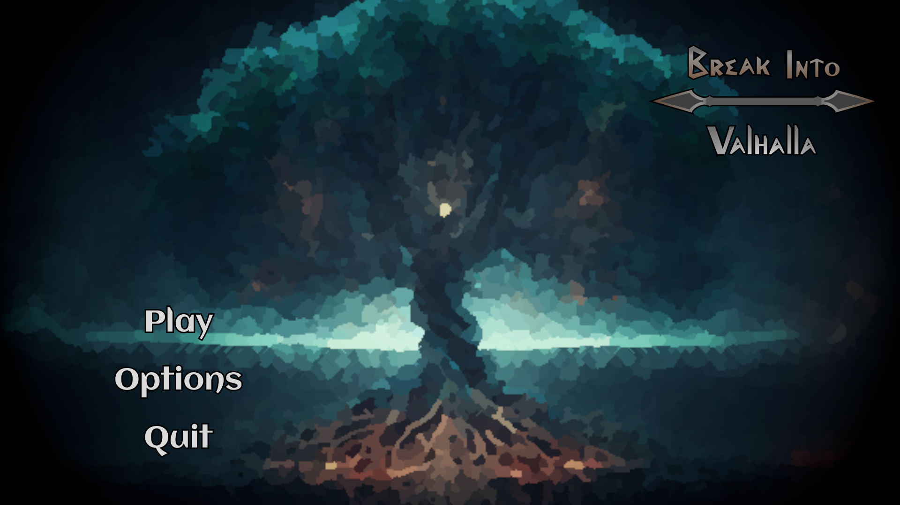

#### In-Game UI
Components:

1. Weapon Slots
2. Health Points
3. Cooldown (blessing) icon

#### Loading Screen
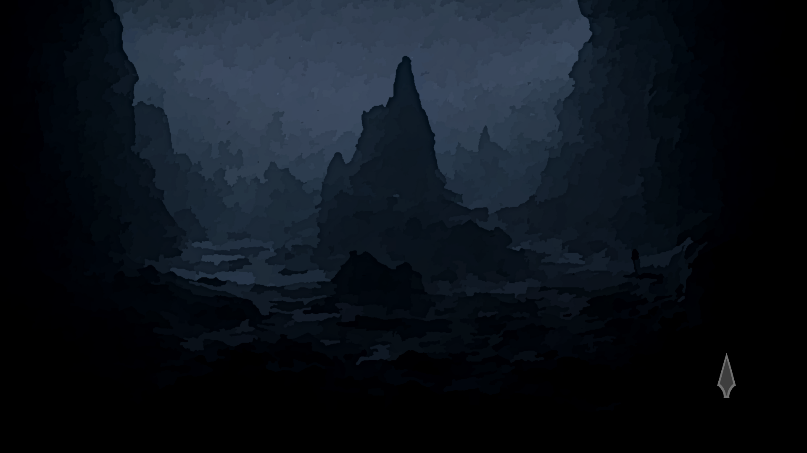

#### Pause Menu
Dark background with 90% opacity. Will contain the following buttons:
1. Resume
2. Restart
3. Options
    1. Volume
5. Exit to Title Screen

#### Ending Screen
The ending will contain a special cutscene (we won't spoil it here...) and the credits will have a static background with a voice (Odin's voice) congratulating you on completing the game.
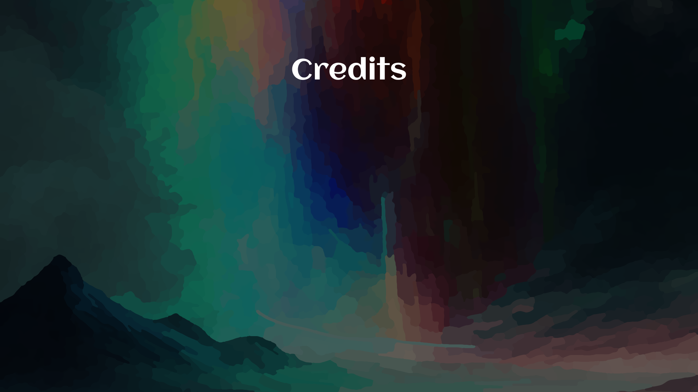

### **Controls**

The intended controllers are going to be the following:
* WASD keys for movement though arrow keys can also be used
* The Ctrl key activates a dash, available for use 
* F key will interact with map, picking up items or buying stuff in the store
* Space bar will be the "pause button" so it accesses the menu
* Dot key uses primary attack attack (base weapon)
* Single quote key uses secondary attack attack (picked up weapon)

Please refer to the next keyboard layout (US), to look at how the keybinds are expected to look like:
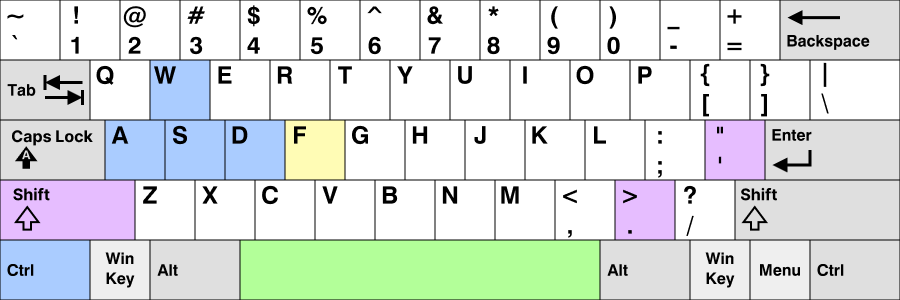

The clear blue represents keys related to movement, ctrl is a dash. The keys highlighted with light purple are cooldowns and attacks: shift activates the blessing and the rest of the keys are the two types of attack (one for each weapon). Green represents the space bar that pauses the game and yellow is used to interact with the map. This is striving for ergonomics and the players' comodity.

### **Mechanics**

* Procedural level generation
	* Graph based level layout
	    * Nodes specify which types of rooms are in the level
	    * Edges represent how the rooms are connected, _e.g. you can only reach the boss by passing through the shop room that is connected to the entrance._
        * Below you can see an example graph

        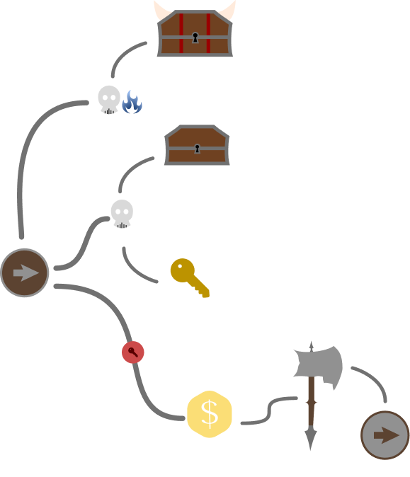

	* Human-designed rooms
	    * The rooms will be saved as prefabs and the procedural generation algorithm will choose random prefabs of each type to be placed.
    * Rooms will have exits with triggers, so that after reaching them, a prefab with the next level according to the hierarchy is loaded
        * There will be a game object storing the hierarchy of the level: so that using indices we can access the "children" of a room when the player traverses a door or even go to the "parent" room.
    * Recreating rooms from saved data
        * Rooms will be stored using (list) indices, so that it is enough to store the indices and allow for the recreation of a level.
        * Up to now we have considered the use of an adjacency list as a way to represent edges, which will only be used to store the game data and to recreate the dungeon.
        * For our development we will first make sure that static layouts are implemented (e.g. the left door in the entrance always leads to a chest room). However we would like to implement more general layouts so that only the fact that a connection between room A and room B is preserved.

Procedural generation, besides being a defining feature of the roguelike/rougelite genre, allows us to create an incredible amount of content. However by using a completely random generation alogrithm the qualitiy of the rooms could be diminished. Therefore the previously defined approach (using a graph and creating prefabricated rooms), we can create a reasonable amount of content ourselves in the time we have available for development, but allow for an exponential number of unique dungeons to be created... If our graph has $n$ rooms and we design $m$ prefabs for each room, we would have to design $nm$ rooms, but there will be $n^m$ unique dungeons. This contributes to the feel that in this game your experience is **unique**, which is expected from a Role Playing Game. However we are trying to make the experience as balanced as possible (randomness should not make the game harder for some player) and thus the graph allows us to define "categories" for the rooms, so that dungeons are created with similar difficulties.

Using a graph has another important implication. We want the game to break to some extent with the usual roguelite by incorporating elements of metroidvanias. In particular we want the dungeon to feel non-lineal so that the player has to traverse some paths on the dungeon to find a key and then use this key to reach the boss; but without forcing them to traverse all rooms (allowing for decision-making). The graph ensures that it is always possible to get the key and the difficulty of the dungeon lies on the complexity of the graph.

Following some ideas from metroidvanias, we would also like to make the keys feel somewhat cryptic: for instance you find a broken bridge at the beginning, which blocks you from advancing; thus you take another path and after some time you find a magic power that allows you to freeze water. You remember the broken bridge so then you return to that place, a trigger event recognizes that you have the required item and the water is frozen before you, creating a path to move forward. We understand that this idea is ambitious and therefore **we will first guarantee that locked doors are implemented with normal keys** (independently of sprites and animations) and then decide if we have sufficient time to create the more interesting aesthetic-oriented and less evident locked doors.
* Enemies
	* Path finding
	    * The path will be selected to be the shortest path to player if it's a melee enemy.
	    * The ranged enemy will tend to keep their distance as much as possible and will try to align itself with the player while shooting.
	* Attack players based on proximity
	    * Both enemies will attack when player is in range:
	        *  when melee, it'll be when the player is close enough. 
	        *  with ranged it will be when player enters the file or row where the ranged enemy is, a range exactly like the rook chess piece. 
	* Strategic placement on rooms
	    * Enemies will be positioned in rooms when making the prefabs.
	* Random loot drops (mainly coins)
	    * Every kill gives a random number of coins between 1 and 10.

Enemies are an important element of the game, the player should always feel a risk when taking a path on the dungeon but rewarded after succesfully completing a battle. Health will be scarce due to a limited number of healing items, however after beating lots of enemies players will be able to use the resources collected from their loot to buy items (look at the shops below).

* Player Mechanics
	* Cooldown Abilities (_Blessings_) are high risk high reward abilities that depending on the situation get you as a player out of a pinch but the wrong decision could lead to a terrible outcome. 
	* Players have 2 weapon slots and can use any of the two.
	* For those who can shoot projectiles, there will be a limited amount of ammo available
	* Players will be able to dash every 6 seconds.

Player mechanics are centered on decisions. Blessings are expected to be a character's most powerful ability, but that doesn't mean they will just enable your character to destroy enemies with single hits, the decision of wether or not to use them makes the gameplay interesting since players must be strategic about their builds and uses of their resources.
* Shops
    * The shop indicates the player that moving forward leads to the exit of the dungeon and therefore to a boss battle. Here they will be able to manage their resources to influence their chances of success in the epic battle that awaits them.
    * Shops will have only one of each item available for purchase (10% potion, 50% potion, Weapon 1 upgrade, Weapon 2 upgrade)
	* Health recovery items
	    * Health is one of the most valuable resources in our game and therefore potions are expensive. 
	    * The health consumables will restore a certain percentage of the players maximum health
	    * There are 2 types of potions: 
	        * 10% potions which will cost 100 coins
	        * 50% potion with a cost of 450 coins.  
	* Weapon Upgrades (Sacred Treasures)
	    * Weapon upgrades will allow players to increase the base stats of their weapons, this could be the attack speed or damage, but we will focus primarily on implementing damage upgrades.

We are giving a lot of emphasis to the shop as a way for the player to take decisions that will influence their chance of success in the heroic battle that lies ahead. It is positioned right before the boss fight to ensure that the way a player handles their resources is not affected by chance. Players that dominate the combat mechanics will be able to spend their resources on weapon upgrades, this is a way to reward them for their mechanical skill. Players that were injured in battle will have to question if they should dive into more rooms on the dungeon to gather more resources or have a small chance of getting their health back from chest drops.

* Chests
	* There are chests with different &laquo;values&raquo; or &laquo;rarities&raquo;:
	    * Basic chests.
	    * Odin's Favours (Legendary chests).
	* Basic chests can only drop 80 coins or 10% potions, with a 90:10 ratio.
    * Odin's Favours can only drop Weapon upgrades (Sacred Treasures) or 50% potions, with a 95:5 ratio. This decision was taken to make health as scarce as possible without it being unfair.

## _Level Design_

---

### **Themes**
_Refer to the [Graphics Needed](#graphics-needed) section to see the sprites currently selected for the project._

1. **Helheim**
    1. Unforgiving, cold, foreboding
        1. Water 
        2. Ice
        3. Stone
        4. Wood
    2. Objects
        1. _Ambient_
            1. Lost souls (skulls)
        2. _Interactive_
            1. Melee Draugr (zombies)
            2. Ranged Draugr (zombies)
2. **Hel's Throne Room**
    1. Mood
        1. Dangerous, overwhelming, heavy, misty
            1. Dark Stone
            2. Dark (deep) Water
        3. _Ambient_
            1. Lost souls (skulls)
            2. Mist
        4. _Interactive_
            1. Hel
        
### **Game Flow**

1. Banished from Valhalla you begin in Helheim.
2. When exploring, you find a forked path that leads to 3 rooms. (these are procedurally generated and will be randomized)
3. One of the rooms is a big battle, the other, a hard battle and the last of them is a shop where you can stock up on essentials for your treacherous journey (items and consumables). 
4. Each battle sends you to a reward worthy of your bravery in battle.
5. The shop is to be the last of your stops to take on the boss while fully equipped
6. Fight the most legendary of all trials against Hel and be rewarded for your prowess brave warrior.
7. Your triumphant return to Valhalla.

#### The Game Loop
Due to the nature of Roguelites, the game flow is expected to work to a great extent as the game loop. However, some aspects of the game should evolve after beating the boss to give a sense of progression. We are going to focus on increasing the difficulty of the game with each run by increasing the enemies health pools and damage, however it would be interesting to add some sort of evolution to the loadout of the player or in the map as you complete distinct difficulties of the game.

## _Development_

---

### **Abstract Classes / Components**

1. Character
2. IEnemy (Enemy Interface)
3. IWeapon (Weapon Interface)
4. Consumable (Effects are applied immediately)
5. Door (loads next room)

### **Derived Classes / Component Compositions**
1. Character
    1. Player
    2. Melee Draugr
    3. Archer Draugr 
2. IEnemy
    1. Melee Draugr
    2. Archer Draugr 
3. IWeapon
    1. Great Bow
    2. Recurve Bow
    3. Dagger
    4. Saber
4. Consumable
    1. Upgrade weapon
    2. 10% Horn (Health potion)
    3. 50% Horn (Big Health potion)
    4. Coin (increases players currency)
5. Key
6. Door
    1. LockedDoor (checks if key was obtained)
7. DungeonGenerator
8. EnemySpawner
    1. Contains enemy (Archer/Melee Draugr) to spawn
9. Chest (drops consumables)
    1. Contains list of consumables
10. Shop
    1. Contains list of consumables

## _Graphics_

---

### **Style Attributes**

The colors we'll use are mainly going to be either cool colors or extremely dark colors in order to create the concept of Helheim being a cold burn, an icy realm where all hope is lost.

Our art style is going to be pixel art that mostly has solid colors with no stroke that combines tiles of stone and ice joined by a wooden bridge.

#### Interaction
There is going to be a glow around the player when the cooldown is used so the player knows they're blessed. A particle effect each time the player takes damage and a change in the health bar to let players know they were damaged. Another thing we plan on implementing is the health bar turning different colors when nearing lower percentages going from green through yellow to red. When you can claim an object you see it levitate and there's a pop up saying what key you can claim it with. 

### **Graphics Needed**

#### Characters
---
Female and Male Archers (idle, walking, slashing, shooting)

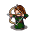 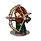
 
Draugrs (idle, walking, slashing, shooting)

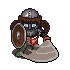 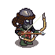

#### Tileset
---

Ice tiles

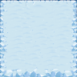

Stone Tiles
        
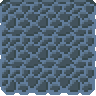

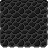

Wood Tiles (Bridges)

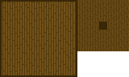
    
Water Tiles

        
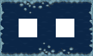

#### Ambient
---
Lost Souls Tiles (Skeletons/Skulls)

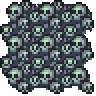

#### Interactable Objects
---
Chests

Basic Chests

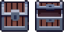

Legendary Chests (Odin's Favors)

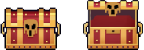

Keys

Coins

Horns (health recovery)

 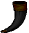

## _Sounds/Music_

---

### **Style Attributes**

Our music is intended to have a medieval mood and a viking theme within it, so you actually feel the changes between Valhalla an Helheim, and also have fighting music.

We want to have sound effects that reflect exaggerate actions, but also still give off a viking feel to them, so they will be realistic to an extent but still contain exaggeration.

### **Sounds Needed**

1. Effects
    1. Footsteps
        1. Snow Footsteps
        2. Stone Footsteps
        3. Wood Footsteps
    2. Slash
    3. Shoot
    4. Zombie Grunts
    5. Chest Opening 
        1. Basic Chest
        2. Legendary Chest (Odin's Favor)
    6. Coin Collection
    7. Buying (coin toss)
2. Feedback
    1. Hurt Grunt (Attacked)
    2. Drinking (Health Restored)
    3. Death Grunt (Died)

### **Music Needed**

1. Soothing "Valhalla" background track

    Valhal - By Danheim.

2. Deep and Ominous "Helheim" track

    Ulfhednar - By Danheim.

    Berserkir - By Danheim.

3. Nerve wracking "Last Fight Preparation" track

    Floki's Last Journey - By Danheim.
    It will be used both for the tavern and the corridor leading     to Hel's throne room.

4. Epic, fast paced "Hel's Throne" track

    Akatsuki Theme from Naruto Shippuden
 
## _Schedule_

---

1. Find and create graphical assets
    1. Sprites
    2. Tilesets
    3. Animations
2. Develop base classes
    1. Player
        1. male archer
        2. female archer
    2. Enemies
        1. ranged draugr (archer zombie)
        2. melee draugr (saber zombie)
3. Base app state
        1. Title screen
        2. Game world
4. Design rooms and the final boss stage
5. Start focusing on mechanics
    1. Procedural map generation
    2. Player cooldowns (dash and blessing)
    3. Ergonomic and functional controls
6. Develop other derived classes
    1. Chests
        1. Different rarities
        2. Loot
        3. Set the yields correctly
    2. Tavern
        1. Restore items
        2. NPC
        3. Style assets
7. Design levels
    1. Tutorial 
        1. Introduce motion/attacking (slashing and shooting plus shot cooldown)
        2. Introduce picking up items
        3. Introduce dash and explain cooldown
        4. Explain blessing further
        5. Mind the pacing, let the player play between lessons
    2. Game
        1. Make it challenging but not impossible so it's rewarding and not discouraging
        2. Make decisions important on the long run
    3. Boss Fight
        1. This is the toughest trial and it must feel as such, make the fight challenging at first and make it harder once boss hits 50% HP and modify its behavior a nit 
8. Design sounds
    1. Sound effects for players/enemies for different circumstances such as being hit, death, recovering health, attacks (slashing/shooting), opening chests and different footsteps.
9. Design music
    1. Editing of music so that it can be repeated without cuts.
    2. Songs selected for each independent "zone", valhalla, helheim, tavern and boss fight.
10. Testing
    1. Find beta testers
    2. Test the game ourselves
    3. Mechanics will be tested during development, but the game as a whole will be tested again (ideally) 3 days before the deadline